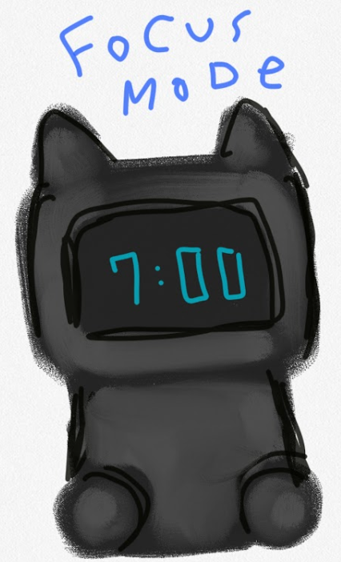
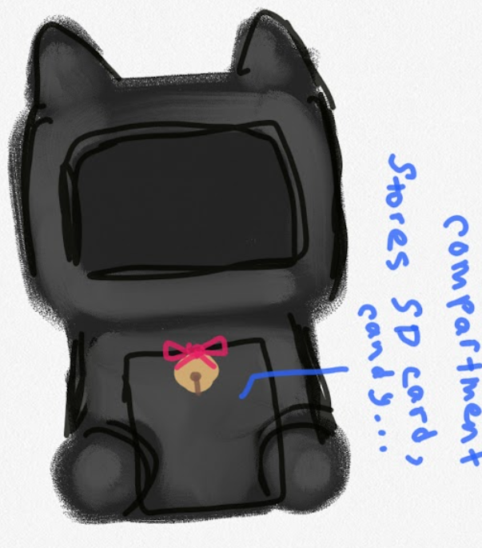

# June 12th: Initial idea & concept art

Inspired by Tamagotchi and LivingAI's EMO robot, I sketched ideas for a kitty desk pet. Focus mode is a must-have!!!! I hope to make a pomodoro timer. I'm also considering adding a storage space if I make the body hollow.

**Time spent: 30 minutes**
